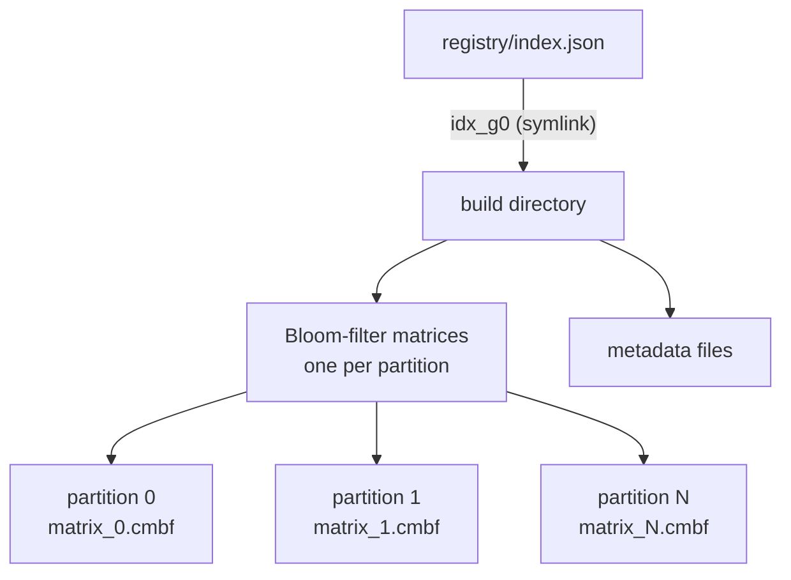

# kmindex Index

## What is an index

An index is a set of Bloom filters, one per sample, that answer a single question:
does this k-mer appear in this sample? Building an index counts each sample's k-mers
into Bloom filters; querying tests a sequence's k-mers against those filters and
reports, per sample, the fraction found.

??? abstract "Bloom filter"
    A space-efficient probabilistic structure that tests set membership: it can
    return false positives but never false negatives. See
    [Wikipedia](https://en.wikipedia.org/wiki/Bloom_filter).

## Structure

kmhelpers manages indices through a **registry** directory,
containing an `index.json` file listing each index name and its parameters (k-mer
size, partition count, samples...). Each index name is a symlink to the physical
build directory holding its actual data: a Bloom-filter matrix per partition, plus
the metadata (such as hashing parameters) needed to query it.

??? abstract "`index.json`"
    ```json
    {
        "index": {
            "idx_g0": {
                "smer_size": 21,
                "nb_partitions": 4,
                "bloom_size": 10496,
                "nb_samples": 6,
                "samples": ["data_0", "data_1", "..."]
            }
        }
    }
    ```

k-mers are split across partitions by minimizer, not by sample, so a query only
touches the partitions its k-mers fall into. See
[Choosing Groups and Partitions](tuning-groups-partitions.md) for how the partition
count (and the related group count) affect query time, RAM, and storage.



## Compression

`matrices/*.cmbf` are stored uncompressed by default. [`compress`](../commands/compress.md)
recompresses them in place to `matrices/blocks*`, optionally reordering sample columns first for a better
ratio. 


