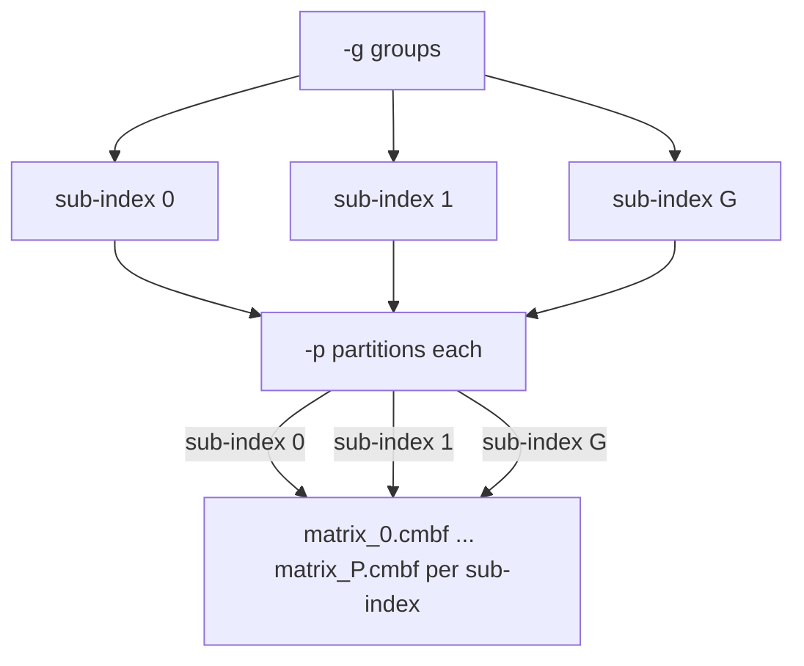

# Choosing Groups and Partitions

## Two independent knobs

Index layout is controlled by two separate settings:

- `-g, --group` ([`profile`](../commands/profile.md), [`design`](../commands/design.md))
splits samples into `G` storage-balanced sub-indices.
- `-p, --partition-count`
([`compose`](../commands/compose.md), [`design`](../commands/design.md),
[`plan`](../commands/plan.md), [`build`](../commands/build.md),
[`apply`](../commands/apply.md)) splits each sub-index's Bloom-filter matrix into `P`
partition files.

## Summary

Direction to move each knob to optimize for a given goal:

| Goal            | Groups (`-g`)  | Partitions (`-p`)  |
|-----------------|:--------------:|:------------------:|
| Faster queries  | -              | -                  | 
| Lower build RAM | +              | +                  |
| Less storage    | +              |                    |

`+` increase, `-` decrease, blank = not a practical lever. 

For example, to speed up queries, lower `-g` first, then `-p`. If build RAM is
constrained, raise `-p` first, then `-g`.

## Query time

Fewer groups and fewer partitions both mean fewer files opened per query.

## Build RAM

More partitions and more groups both shrink the Bloom-filter matrix built at once,
lowering peak build RAM.

## Storage

More groups balances Bloom-filter size across samples more tightly, reducing
wasted space. Partition count has no meaningful effect on storage.

## Practical trade-off

Fewer groups/partitions favor query speed but raise build RAM; more groups/partitions
favor build RAM and storage but raise files touched per query. Tune with `-g`
(`profile`/`design`) and `-p` (`compose`/`design`), and check `groups.png` (from
`profile`) before deciding.