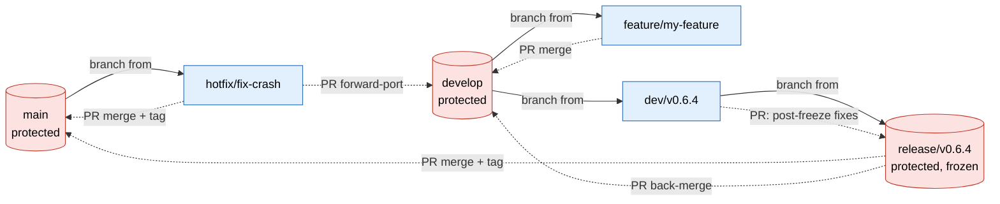

# Contributing to kmhelpers

## Dev environment setup

```bash
git clone https://github.com/sebllns/kmhelpers
cd kmhelpers
pip install -e ".[dev]"
```

`kmindex` and `kmtricks` must also be available — see [Installation](../getting-started/installation.md).

## Project structure

```
pykmhelpers/
  cli/          # Click commands (one file per command)
  core/         # Low-level building blocks (index, bloom_filter, kmindex_wrapper, …)
  operations/   # Higher-level operations (builder, fof_validation, …)
  tests/        # Test suite
  pipeline/     # Pipeline execution engine
```

Each CLI command in `cli/` is a thin layer that delegates to `operations/` or `core/`.

## Running tests

```bash
pytest
```

Coverage is reported automatically (configured in `pyproject.toml`). HTML report is written to `htmlcov/`.

## Code style

| Tool | Purpose |
|------|---------|
| `black` | Formatting (line length 88) |
| `flake8` | Linting |
| `mypy` | Type checking |

```bash
black pykmhelpers/
flake8 pykmhelpers/
mypy pykmhelpers/
```

## Branching

**Protected** (PR-only; no direct push, force-push, or deletion):

| Branch pattern | Purpose |
|----------------|---------|
| `main` | Stable, released code |
| `develop` | Integration branch for ongoing work |
| `release/vX.Y.Z` | Frozen release candidate, gate to `main` |

**Long-lived** (unprotected, permanent):

| Branch pattern | Purpose |
|----------------|---------|
| `docs` | Docs source; pushes trigger the `mike` deploy workflow |
| `paper` | JOSS paper build; `paper.pdf` committed by CI here only |
| `gh-pages` | Auto-managed by the `mike` docs workflow, do not push manually |

**Working** (unprotected, short-lived; deleted after merge):

| Branch pattern | Purpose |
|----------------|---------|
| `dev/vX.Y.Z` | Release staging: version bump, changelog, stabilisation fixes |
| `dev/<topic>` | Topic-scoped development (e.g. `dev/spans_to_groups`) |
| `feature/<name>` | Self-contained feature work |
| `hotfix/<name>` | Urgent fix branched from `main` |
| `doc/<name>` | Documentation-only changes |

Open pull requests against `main` for releases, or against `develop` for work in progress.

## Workflow scenarios

This repo uses a git-flow style layout: `main` (stable/released), `develop` (integration), `feature/*` (work in progress), `release/*` (release staging), and `paper` (the JOSS/paper build). The sequences below are the exact commands to follow so duplicate-history problems do not recur.

### Branch protection

`main`, `develop`, and `release/*` are **protected**:

- **No direct push.** Every change lands via a Pull Request merged on the platform (GitHub). You never run `git push origin main` / `develop` / `release/*` locally.
- **No force-push, no deletion.** `--force` and `--force-with-lease` are both rejected on these branches by the server, regardless of any client-side lease. Deletion is blocked too.
- **Only unprotected branches** (`feature/*`, `hotfix/*`, `paper`) may be pushed to directly, force-pushed (with `--force-with-lease`), and deleted locally.

Every "integrate into a protected branch" step below is a **PR merge on the platform**, shown with `gh pr` for reference. The local `git merge` + `git push` form is only valid for unprotected branches.

### Branch flow overview

Solid lines = branch created from. Dashed lines = PR merge (into a protected branch). Protected branches are `main`, `develop`, `release/*`.



Reading it:

- **Feature**: branch off `develop`, PR back into `develop`.
- **Release**: `develop` -> `dev/vX.Y.Z` (stage) -> `release/vX.Y.Z` (freeze) -> PR into `main` (tag) and back into `develop`.
- **Hotfix**: branch off `main`, PR into `main` (tag) and forward-port to `develop`.

Every arrow landing on a protected branch (dashed) is a PR merge; nothing is pushed to `main`, `develop`, or `release/*` directly.

### Start a new feature

Always branch from an up-to-date `develop`, never from `main`.

```bash
git checkout develop
git pull --no-rebase                 # merge, keep commit identity stable
git checkout -b feature/my-feature
# ... work, commit freely ...
git push -u origin feature/my-feature
```

Rebase is fine *here* while the branch is still private, to tidy local commits before the first push:

```bash
git rebase -i develop                # ONLY before the first push / while unshared
```

Once pushed and shared, stop rebasing it.

### Keep a feature current with `develop`

While the feature is open and `develop` moves ahead, integrate by **merging**, not rebasing, so you never rewrite already-pushed commits:

```bash
git checkout feature/my-feature
git fetch origin
git merge origin/develop             # brings develop's new work in, stable SHAs
# resolve conflicts if any, then:
git push
```

If you truly must rebase a shared feature branch, coordinate with everyone on it first, then force-push safely:

```bash
git rebase origin/develop
git push --force-with-lease          # never plain --force on a shared branch
```

This is valid ONLY because `feature/*` is unprotected. The same command against `main`, `develop`, or `release/*` is rejected by the server; integrate via PR instead.

### Merge a feature into `develop`

Open a PR into `develop`. On merge, pick ONE strategy and stick to it:

- **Squash-merge** (recommended for tidy history): the PR becomes one commit on `develop` with a new SHA. Because the original commits now have a different identity, you MUST delete the feature branch and not reuse it:

  ```bash
  # after the squash-merge is done on the remote:
  git branch -d feature/my-feature
  git push origin --delete feature/my-feature
  ```

  Reusing a squash-merged branch is what produces "same content, new SHA" duplicate commits.

- **Merge commit** (preserves individual commits): keeps SHAs, no duplication, but a noisier graph. Fine for large features you want to keep granular.

Do not mix strategies: squash-merging and then also merging the old branch later creates duplicate-commit divergence.

## Releasing

!!! abstract
    A release consolidates current development work from `develop` into a dedicated `release/vX.Y.Z` branch, then merges it into `main` with a **merge commit** (`--no-ff`). This keeps `main` readable, one merge commit per release when viewed with `--first-parent`, while preserving full history and correct ancestry, so subsequent releases keep merging cleanly.


This repo uses a two-branch release pattern:

- **`dev/vX.Y.Z`** = unprotected staging. Version bump, changelog, and all stabilization fixes are committed here directly - no PR needed to touch it.
- **`release/vX.Y.Z`** = protected, frozen release candidate. Created FROM the staging branch, and is the reviewed gate that flows to `main`.

Creating a protected branch from an existing ref is allowed; protection only blocks force-push, direct push of new commits, and deletion. So `release/vX.Y.Z` inherits the bump + fixes in one shot, with no PR to populate it.

```bash
# 1. staging branch off develop (UNPROTECTED - commit freely)
git checkout develop
git pull --no-rebase
git checkout -b dev/vX.Y.Z
# bump version, changelog, last fixes committed directly here
git commit -am "Bump version to X.Y.Z"
git push -u origin dev/vX.Y.Z
```

On `dev/vX.Y.Z` you finalise the release, bump the version, update the changelog, and land any last fixes, committing directly since it is unprotected.

```bash
# 2. protected release branch, created FROM the staging branch (creation allowed)
git checkout -b release/vX.Y.Z dev/vX.Y.Z
git push -u origin release/vX.Y.Z
```

Branching from `dev/vX.Y.Z` makes `release/vX.Y.Z` inherit the bump, changelog, and fixes with no PR to populate it (creating a new branch is allowed; only later pushes of commits to it are blocked). Branch from `dev`, not `develop`, which lacks the bump/changelog.

Once pushed, `release/vX.Y.Z` is **frozen**. Post-freeze fixes go on `dev/vX.Y.Z`, then reach the candidate via a PR `dev/vX.Y.Z -> release/vX.Y.Z`.

When ready, integrate the release into BOTH `main` and `develop` via PRs, then tag `main`:

```bash
# PR 1: release -> main
gh pr create --base main --head release/vX.Y.Z \
  --title "Release vX.Y.Z" --body "Release vX.Y.Z"
# review, then merge on the platform choosing "Create a merge commit"

# after it merges, tag the merge commit on main:
git checkout main
git pull --no-rebase
git tag -a vX.Y.Z -m "Release vX.Y.Z"
git push origin vX.Y.Z               # pushing a TAG is allowed; pushing the branch is not

# PR 2: release -> develop  (back-merge, keeps main and develop aligned)
gh pr create --base develop --head release/vX.Y.Z \
  --title "Back-merge release vX.Y.Z into develop" --body "Keep develop aligned"
# merge on the platform (merge commit)
```
