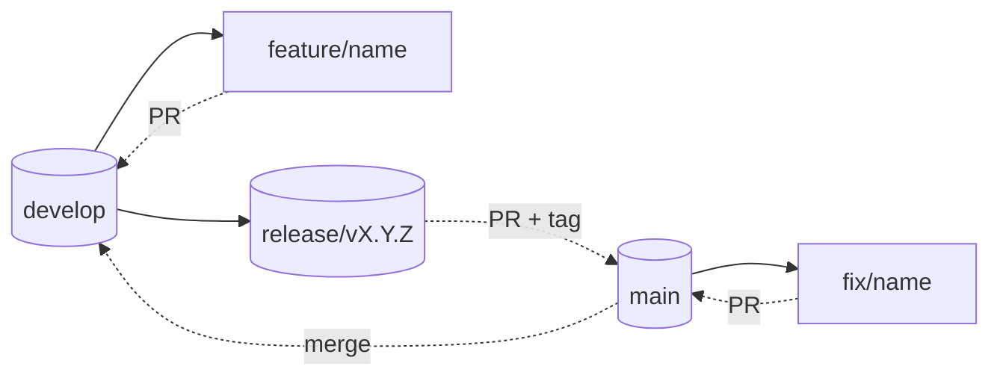

# Contributing to kmhelpers

## Dev environment setup

```bash
git clone https://github.com/sebllns/kmhelpers
cd kmhelpers
pip install -e ".[dev]"
```

`kmindex` and `kmtricks` must also be available, see [Installation](../getting-started/installation.md).

## Project structure

```
pykmhelpers/
  cli/          # Click commands (one file per command)
  core/         # Low-level building blocks (index, bloom_filter, kmindex_wrapper, ...)
  operations/   # Higher-level operations (builder, fof_validation, ...)
  tests/        # Test suite
  pipeline/     # Pipeline execution engine
```

Each CLI command in `cli/` is a thin layer that delegates to `operations/` or `core/`.

## Running tests

```bash
pytest
```

Coverage is reported automatically (configured in `pyproject.toml`). HTML report is written to `htmlcov/`.

## Code style

| Tool | Purpose |
|------|---------|
| `black` | Formatting (line length 88) |
| `flake8` | Linting |
| `mypy` | Type checking |

```bash
black pykmhelpers/
flake8 pykmhelpers/
mypy pykmhelpers/
```

## Branches

| Branch | Purpose | Updated by |
|--------|---------|------------|
| `main` | Released code, each release tagged `vX.Y.Z` | PR |
| `develop` | Integration of ongoing work | PR |
| `release/vX.Y.Z` | Next release: shipped features, version bump, CHANGELOG | PR |
| `feature/<name>`, `fix/<name>`, `doc/<name>`, `ci/<name>` | Short-lived work, deleted after merge | Direct push |
| `docs` | Docs source; a push deploys the preview | Direct push |
| `paper` | JOSS paper; `paper.pdf` is committed by CI | Direct push |
| `gh-pages` | Generated by the docs workflow, never edited by hand | CI |

`main`, `develop` and `release/*` are protected: changes land through pull requests.

## Workflow


```mermaid
flowchart LR
    develop[("develop")]
    feat["feature/name"]
    rel[("release/vX.Y.Z")]
    main[("main")]
    fix["fix/name"]

    develop --> feat
    feat -.->|PR| develop
    develop --> rel
    rel -.->|PR + tag| main
    main --> fix
    fix -.->|PR| main
    main -.->|merge| develop
```

- **New work**: branch from `develop` (or from the open `release/vX.Y.Z` when it
  targets that release), then open a PR back into it.
- **Fix on released code, docs, CI**: branch from `main`, open a PR into `main`,
  then merge `main` into `develop` and into the open release branch.

```bash
git checkout develop
git pull --no-rebase
git checkout -b feature/my-feature
# ... commit ...
git push -u origin feature/my-feature
gh pr create --base develop
```

Rules:

- Merge PRs with a merge commit, not squash: long-lived branches are merged into
  each other, and squashed commits would come back as duplicates.
- Do not rebase a pushed branch; bring changes in with `git merge`
  (and `git pull --no-rebase`).
- `git push --force-with-lease` only on your own, unshared working branch.

## Releasing

`pykmhelpers/_version.py` is the single source of the version. Commands below
use `VERSION=X.Y.Z`.

### 1. Prepare the release branch

```bash
git checkout develop
git pull --no-rebase
git checkout -b release/v$VERSION
git merge origin/main               # fixes released since the last version
git push -u origin release/v$VERSION
```

Merge the features to ship into this branch (PRs, or `git merge feature/<name>`).

### 2. Bump the version and write the CHANGELOG

- Set `__version__ = "X.Y.Z"` in `pykmhelpers/_version.py`.
- Add the `## [X.Y.Z] - YYYY-MM-DD` section to `CHANGELOG.md`. It becomes the
  GitHub release notes, so it must be written before tagging.

### 3. Check

```bash
pytest
rm -rf dist && python -m build && twine check dist/*
```

### 4. Merge into `main`

```bash
gh pr create --base main --head release/v$VERSION \
    --title "Release v$VERSION" --body "See CHANGELOG.md"
gh pr checks --watch
gh pr merge --merge
```

### 5. Tag

```bash
git checkout main
git pull --no-rebase
git tag -a v$VERSION -m "kmhelpers v$VERSION" \
    -m "Documentation: https://sebllns.github.io/kmhelpers/$VERSION/
Changelog: https://sebllns.github.io/kmhelpers/$VERSION/changelog/"
git push origin v$VERSION
```

Never move or re-create a pushed tag.

### 6. Release workflow (automatic)

Pushing the tag runs `.github/workflows/release.yml`:

- builds the sdist and wheel,
- creates the GitHub release with the files attached; its notes are
  `.github/release-notes.md` (docs links, install and update commands), the
  CHANGELOG section of the version, then the list of merged PRs generated by GitHub,
- uploads the files to PyPI (`publish` job, once enabled).

```bash
gh run list --workflow release.yml --limit 3
gh release view v$VERSION
```

A PyPI version cannot be uploaded twice: a broken release is fixed by a new version.

### 7. Deploy the docs

```bash
git checkout docs
git pull --no-rebase
git merge main
git push                            # deploys the preview
gh workflow run docs.yml --ref docs # deploys version X.Y.Z as latest
```

Add `-f delete_version=<old>` to the last command to remove an old docs version.

### 8. Merge back into `develop`

```bash
gh pr create --base develop --head main --title "Merge v$VERSION into develop" --body ""
gh pr merge --merge
```

On conflicts, merge `main` into a working branch created from `develop`,
resolve, and open the PR from that branch instead.

### 9. Bioconda

After the PyPI upload, the bioconda bot opens a PR in
[bioconda-recipes](https://github.com/bioconda/bioconda-recipes) updating the
version and sha256. Check that runtime dependencies still match
`pyproject.toml`, then approve it.

### Patch release

For a fix on the released version: branch `fix/<name>` from `main`, commit the
fix, the version bump and the CHANGELOG section, open a PR into `main`, then
follow steps 4 to 9.