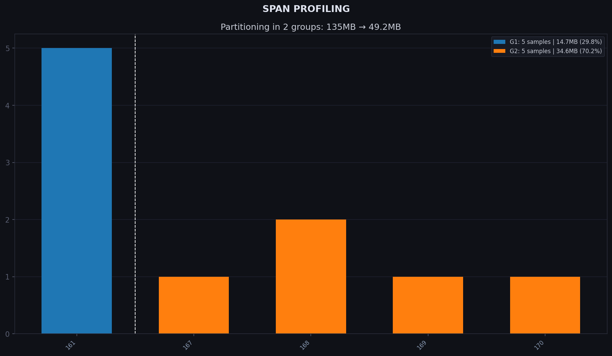

# Tutorial: Indexing *E. coli* Assemblies

This tutorial walks through the full kmhelpers workflow on a real public dataset:
3 682 *E. coli* assemblies downloaded from NCBI and archived on Zenodo.

> Jarno N. Alanko. (2022). *3682 E. coli assemblies from NCBI* [Data set].
> Zenodo. <https://doi.org/10.5281/zenodo.6577997>

By the end you will have a queryable k-mer index of these assemblies built in
five commands: `list` → `profile` → `compose` → `plan` → `apply`.

---

## Prerequisites

- **kmhelpers** installed (see [Installation](../installation.md))
- ~25 GB of free disk space for the dataset and the resulting index

### Dependencies

The following tools are installed alongside kmhelpers when using the conda environment:

- **[kmindex](https://github.com/tlemane/kmindex)** — the underlying indexing engine
- **[ntcard](https://github.com/BirolLab/ntCard)** — k-mer counter used by `list`

---

## Step 1 — Download and extract the dataset

```bash
wget https://zenodo.org/records/6577997/files/coli3682_dataset.tar.gz
tar -xzf coli3682_dataset.tar.gz
```

This creates a `coli3682_dataset/` directory containing 3 682 `.fna` assembly
files named after their NCBI accessions (e.g. `GCA_000780515.1_ASM78051v1.fna`).

---

## Step 2 — Create a file list

`kmhelpers list` accepts a plain-text file of sample paths as input.
In the directory where you ran `tar` (the parent of `coli3682_dataset/`), create `zenodo_list_1.txt`.
Paths are relative to that directory, and `kmhelpers list` must be run from the same location:

```bash
cat > zenodo_list_1.txt << 'EOF'
coli3682_dataset/GCA_000780515.1_ASM78051v1.fna
coli3682_dataset/GCA_001076125.1_ASM107612v1.fna
coli3682_dataset/GCA_001417575.1_ASM141757v1.fna
coli3682_dataset/GCA_000944435.1_Ec57A_E8C1_MIRA_assembly.fna
coli3682_dataset/GCA_001075925.1_ASM107592v1.fna
coli3682_dataset/GCA_000936715.1_E8C1_assembly.fna
coli3682_dataset/GCA_000939215.1_Ec57A_A7_MIRA_assembly.fna
coli3682_dataset/GCA_001413795.1_ASM141379v1.fna
coli3682_dataset/GCA_001373195.1_57A_A7_assembly.fna
coli3682_dataset/GCA_000938575.1_D1C4_assembly.fna
EOF
```

---

## Step 3 — Scan samples and count k-mers (`list`)

```bash
kmhelpers list zenodo_list_1.txt -o coli3682_1.jsonl -k 25 -t a
```

`list` reads each path, counts k-mers with ntcard (k = 25), and writes one
JSONL record per sample to `coli3682_1.jsonl`.

The header line records the shared parameters; every subsequent line is one
sample:

```jsonl
{"k": 25, "assembled": true}
{"name": "GCA_000780515.1_ASM78051v1", "files": ["coli3682_dataset/GCA_000780515.1_ASM78051v1.fna"], "kmer_count": 10898876}
{"name": "GCA_001076125.1_ASM107612v1", "files": ["coli3682_dataset/GCA_001076125.1_ASM107612v1.fna"], "kmer_count": 10180102}
...
```
---

## Step 4 — Profile the k-mer distribution (`profile`)

```bash
kmhelpers profile coli3682_1.jsonl -o coli3682_profile/ -b 1.1 -g 2
```

A *span* is an integer bucket that summarises a sample's k-mer count:

$$
s = \left\lfloor \log_{\text{base}}(n) \right\rfloor
$$

where $n$ is the sample's distinct k-mer count. All samples whose k-mer count
falls in the same bucket $[\text{base}^s,\, \text{base}^{s+1})$ share span $s$
and are indexed together in one sub-index.

The Bloom filter allocated for that sub-index is sized for the **worst case**
of the bucket — the maximum k-mer count $\text{base}^{s+1}$ — so every sample
in the span fits:

$$
\text{bf_size} = \left\lceil \frac{f \cdot \text{base}^{s+1}}{8} \right\rceil \times 8
\qquad \text{where } f = \frac{-\ln p}{(\ln 2)^2}
$$

$p$ is the false-positive rate (default 0.25) and the $\times 8$ rounding
aligns the size to a byte boundary.

!!! tip "False-positive rate and findere"
    A higher $p$ reduces Bloom-filter size and therefore disk footprint, at the
    cost of more false positives. At query time the
    [findere](https://doi.org/10.1007/978-3-030-86692-1_13) algorithm
    compensates by querying $(k+z)$-mers instead of $k$-mers, reducing the
    effective false-positive rate to $p^z$:

    $$
    p_{\text{eff}} = p^z
    $$

    **Recommended settings:** build with `--fp 0.25` (default), query with
    `-z 6` (default), giving $0.25^6 \approx 0.024\,\%$ effective FP rate.

    > Lucas Robidou and Pierre Peterlongo. *findere: fast and precise
    > approximate membership query.* SPIRE 2021, Springer, pp. 151–163.
    > <https://doi.org/10.1007/978-3-030-86692-1_13>

!!! tip "Choosing `base` and the number of groups"
    `base` controls bucket width. With `base=2.0` (default) each bucket spans
    a 2× range of k-mer counts, producing few coarse spans. `-b 1.1` narrows
    each bucket to a 10 % range, giving finer resolution at the cost of more
    spans. `-g 2` then requests that those spans be merged into 2 groups
    (chosen here for this small dataset — pick a value that fits your own
    distribution).

`profile` writes three output files to `coli3682_profile/`:

### `baseline.csv`

One row per span: the Bloom-filter size required for that span and how many
samples fall into it.

```
span,bf_size,sample_count
161,14649392,5
167,25952288,1
168,28547520,2
169,31402272,1
170,34542496,1
```

With base 1.1, our 10 assemblies spread across 5 fine-grained spans.

### `profile.yaml`

Records global parameters and one named profile per grouping. The `baseline`
profile preserves the natural 5-span distribution; `2_groups` merges them into
two sub-indices:

```yaml
false_positive_rate: 0.25
span_base: 1.1
sample_count: 10
biggest_sample: ('GCA_000780515_1_ASM78051v1', 10898876)
max_kmer_count: 11971516
default_profile: 2_groups
profiles:
  baseline:
    span_list: [161, 167, 168, 169, 170]
    bloom_size: [14649392, 25952288, 28547520, 31402272, 34542496]
    sample_dist: [5, 1, 2, 1, 1]
    disk_usage: [1.47e+07B, 2.6e+07B, 2.86e+07B, 3.14e+07B, 3.46e+07B]
    size_ratio: ['0.109', '0.192', '0.211', '0.232', '0.256']
    total_size: 1.35e+08B
    bytes_per_sample: 1.35e+07B
  2_groups:
    span_list: [161, 170]
    bloom_size: [14649392, 34542496]
    sample_dist: [5, 5]
    disk_usage: [1.47e+07B, 3.46e+07B]
    size_ratio: ['0.298', '0.702']
    total_size: 4.92e+07B
    bytes_per_sample: 4.92e+06B
```

### `groups.png`

A plot showing the k-mer count distribution, natural span boundaries, and the
requested 2-group overlay.

!!! note
    Grouping affects both storage and query performance.

    **Storage:** `kmindex` stores samples in packs of 8 (bit-packing), so a
    sub-index with 1 sample occupies the same disk space as one with 8. In the
    `baseline` profile, spans 167, 169 and 170 hold only 1–2 samples each —
    those near-empty packs waste most of their allocated space, bringing the
    total to **135 MB**. In this case, merging the 5 sub-indices into 2 reduces
    the number of packs from 5 to 2 (one per group), cutting the total to
    **50 MB**.

    **Query time:** each sub-index is composed of multiple partition files
    (`kmindex` terminology). Query performance on large datasets is dominated by
    disk latency rather than CPU, so every sub-index multiplies the number of
    partitions that must be opened and read. Fewer sub-indices means fewer
    partition files accessed per query, directly reducing that latency overhead.



---

## Step 5 — Compose index definitions (`compose`)

```bash
kmhelpers compose coli3682_1.jsonl \
    -o coli3682_db/ \
    -pf coli3682_profile/profile.yaml
```

`compose` reads the sample list and the profile, then writes index definition
files into `coli3682_db/`. The sample-to-sub-index repartition is driven by
the selected profile — here `2_groups`, the default set by `profile` — whose
Bloom-filter sizes, are read from
`coli3682_profile/profile.yaml`.

---

## Step 6 — Preview the build plan (`plan`)

Before committing to a potentially long build, validate paths and preview the
commands that will be executed:

```bash
kmhelpers plan coli3682_db/index.yaml -w coli3682_db/
```

`plan` checks that every sample file exists, reports any missing paths, and
prints the equivalent `kmindex` commands — without running them. Fix any path
errors now rather than discovering them mid-build.

---

## Step 7 — Build the index (`apply`)

```bash
kmhelpers apply coli3682_db/index.yaml -w coli3682_db/ -t 8
```

`apply` runs the build. The `-t 8` flag sets the number of threads; adjust it
to match your machine.

Useful options for long runs:

```bash
# Show a progress bar
kmhelpers apply coli3682_db/index.yaml -w coli3682_db/ -t 8 --show-progress

# Abort immediately on any error
kmhelpers apply coli3682_db/index.yaml -w coli3682_db/ -t 8 --fail-on-error

# Get an email when the build finishes
kmhelpers apply coli3682_db/index.yaml -w coli3682_db/ -t 8 \
    --notify you@example.com
```

Once complete, the index is registered in `coli3682_db/` and ready to query.

---

## Step 8 — Query the index (`query`)

```bash
kmhelpers query -r coli3682_db/ -n index -o results/ query.fa
```

`query` searches the index for every sequence in `query.fa` and writes one
result file per query sequence to `results/`. The index name (`-n index`)
must match the name used during `compose`.

Results are written in JSON by default. Use `-f` to change the format:

```bash
# CSV output
kmhelpers query -r coli3682_db/ -n index -o results/ -f csv query.fa

# Print results to the console as well
kmhelpers query -r coli3682_db/ -n index -o results/ -p query.fa
```

To query all sequences together as a single batch (one result row instead of
one per sequence):

```bash
kmhelpers query -r coli3682_db/ -n index -o results/ \
    --single-query my_batch query.fa
```

Use `-R` to filter out low-confidence hits (fraction of shared k-mers below
the threshold):

```bash
kmhelpers query -r coli3682_db/ -n index -o results/ -R 0.5 query.fa
```

---

## Next steps

- **Compress** the index to save disk space:
  ```bash
  kmhelpers compress -r coli3682_db/ -n index --reorder
  ```
- See the [Command Reference](../commands/index.md) for the full option list of
  every command used here.
